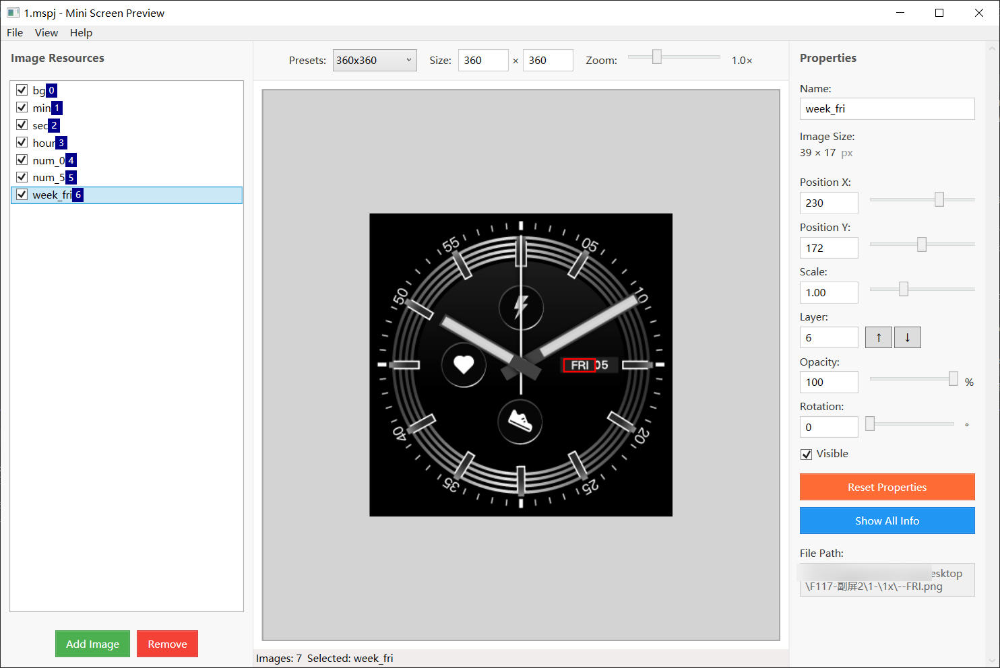

# Mini Screen Preview | 迷你屏幕预览

A WPF application for designing layouts for secondary screen displays.  
用于设计副屏显示布局的 WPF 应用程序。

## Features | 功能特性

### Image Management | 图像管理
- **Drag & Drop Positioning**: Click and drag images to reposition them in real-time  
  **拖拽定位**：点击拖拽图像进行实时重新定位
- **Multi-Image Support**: Add multiple images with individual property controls  
  **多图像支持**：添加多个图像，每个都有独立的属性控制
- **Layer Management**: Organize images with layer ordering (↑/↓ buttons)  
  **图层管理**：使用图层排序组织图像（↑/↓ 按钮）
- **Property Controls**: Adjust position (X/Y), scale (0.1-3.0×), rotation (0-360°), and opacity for each image  
  **属性控制**：调整每个图像的位置（X/Y）、缩放（0.1-3.0×）、旋转（0-360°）和不透明度
- **Visibility Toggle**: Show/hide individual images  
  **可见性切换**：显示/隐藏单个图像
- **Reset Function**: Reset image properties to default values  
  **重置功能**：将图像属性重置为默认值

### Preview & Interface | 预览与界面
- **Real-Time Preview**: See changes instantly in the preview area  
  **实时预览**：在预览区域即时查看更改
- **Zoom Control**: Adjustable zoom level (0.1× - 3.0×) with Ctrl+Mouse Wheel  
  **缩放控制**：可调节的缩放级别（0.1× - 3.0×），支持 Ctrl+鼠标滚轮
- **Size Presets**: Quick selection for common display sizes (240×240, 240×284, 360×360)  
  **尺寸预设**：快速选择常用显示尺寸（240×240、240×284、360×360）
- **Custom Dimensions**: Set custom preview width and height  
  **自定义尺寸**：设置自定义预览宽度和高度
- **Selection Borders**: Visual feedback for selected images with customizable colors (Red/Green/Blue)  
  **选择边框**：为选中图像提供视觉反馈，支持自定义颜色（红/绿/蓝）
- **Scrollable Preview**: Mouse wheel scrolling when zoomed in  
  **可滚动预览**：放大时支持鼠标滚轮滚动

## System Requirements | 系统要求

- **Framework**: .NET 8.0 (Windows)  
  **框架**：.NET 8.0 (Windows)
- **Platform**: Windows (WPF)  
  **平台**：Windows (WPF)
- **File Formats**: PNG, JPG, JPEG, BMP, GIF, TIFF  
  **文件格式**：PNG、JPG、JPEG、BMP、GIF、TIFF

## Technical Details | 技术细节

- **Architecture**: MVVM pattern with data binding  
  **架构**：采用数据绑定的 MVVM 模式
- **Data Persistence**: JSON serialization for project files and settings  
  **数据持久化**：项目文件和设置的 JSON 序列化
- **UI Framework**: WPF with custom controls and converters  
  **UI框架**：具有自定义控件和转换器的 WPF
